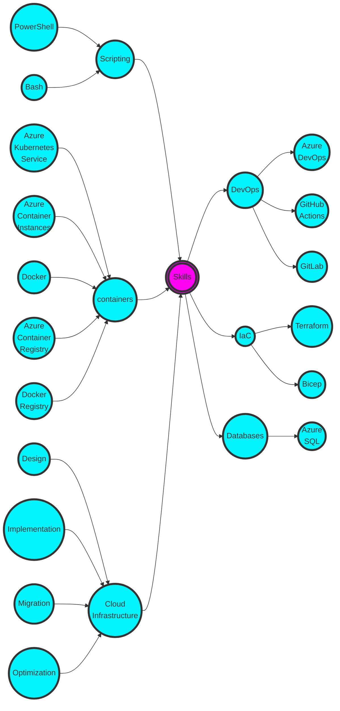

# Hey friends!

I’m **Deiva** :ninja:.

In the path of a shinobi, and the journey of a demon slayer, we find strength in our bonds and resilience in our scars. Embrace the shadows, for within them lies the light that will guide us to become the true masters of our destiny.
  
> You can reach out to me on LinkedIn: https://www.linkedin.com/in/deiva/

## What did I do recently?

### Cloud Infrastructure
- Designed and implemented robust and highly available IaaS/PaaS services in Azure for both greenfield and brownfield environments.
- Developed comprehensive high-level and low-level design documentation, including architectural frameworks.
- Conducted thorough assessments of on-premises applications, designing and implementing end-to-end Azure infrastructures aligned with their specific requirements. Collaborated closely with customers to facilitate smooth migration of their applications from Windows and Linux systems to the designated Azure infrastructure.
- Formulated and executed cost optimization strategies for Azure services.
- Collaborated with product groups to ensure alignment of design strategies with upcoming feature releases.

### Infrastructure as code
- Designed and implemented a modular structure for customers, accommodating both shared and dedicated teams.
- Created Infrastructure as Code (IaC) using Terraform and Bicep for multiple projects, assuming the role of a maintainer for Terraform module repositories.

### DevOps
- Designed and implemented CI/CD flow (repos, pipelines, agent/runner infrastructure, release management) on Azure DevOps.
- Identified and addressed implementation, security, and operational risks during migration and IaC deployments, ensuring effective mitigation measures were put in place.
- Assisted team members and partners in resolving code and deployment issues.
- Developed custom Pester test cases to validate environments.
- Implemented effective branching and release strategies to enhance code development and integration processes.
- Established build system infrastructures to support diverse functional and security requirements.
- Established Azure DevOps organizations from inception, adhering to recommended practices.

### Kubernetes
- Designed and implemented highly available and secure private clusters with automated scaling for microservices on Azure Kubernetes Service.
- Authored Docker and Kubernetes manifest files for seamless deployment of microservices on Azure Kubernetes Service.
- Managed Kubernetes clusters and enhanced application security through the implementation of multiple security controls.
- Executed container and cluster compute optimization strategies for efficient operation of containers on Azure Kubernetes Service.
- Implemented managed Prometheus and Grafana services, leveraging their powerful capabilities to enhance monitoring, visualization, and alerting functionalities, ensuring optimal system performance and data-driven decision-making.

### Scripting
- Developed PowerShell scripts for consuming REST APIs, enabling interaction with services that lack native or third-party management tools.
- Implemented automated security checks, optimized image building processes, and enhanced container boot-up times.
- Developed PowerShell scripts from scratch and modified existing Shell scripts to automate application installations and configurations.

### Coaching/Mentoring

- Conducted technical sessions on Terraform for workgroup and internal IaC community members.
- Actively served as a subject matter expert (SME), providing assistance to colleagues in the Azure, Terraform, and DevOps communities.
  
### Contributions
- Made valuable contributions to the Terraform open-source community.

### Databases
- Designed and implemented Azure SQL solutions using Azure SQL Database and Azure SQL Managed Instances. Successfully migrated on-premises SQL databases to Azure.

## What did I do earlier?

- Served as a virtualization (VMWare & Hyper-V) and server (Microsoft Windows) administrator, responsible for setting up, managing, and securing highly resilient on-prem infrastructures.
- Actively participated in migration initiatives, planning and implementing upgrades for operating systems and applications.
- Proactively identified design and configuration discrepancies during ongoing maintenance activities.
- Collaborated with stakeholders and security teams to deliver security posture dashboards, implement threat mitigations, and contribute to compromise recovery efforts.
- Developed scripts to automate tasks, reducing manual efforts. This included health checks, AD user account management, O365 mailbox management, Azure Managed Disk snapshot clean-up, cluster maintenance, Citrix XenDesktop maintenance tasks, and more.
- Managed CSP Azure subscriptions for multiple customers in an IaaS environment.
- Oversaw Windows updates lifecycle through WSUS and SCCM.
- Administered AD, DNS, and DHCP servers.

## Certifications

- HashiCorp Certified: Terraform Associate
- Microsoft Certified: DevOps Engineer Expert
- GitHub Actions
- Microsoft Certified: Azure Network Engineer Associate
- Microsoft Certified: Azure Database Administrator Associate
- Microsoft Certified: Azure Administrator Associate
- Microsoft Certified: Azure Security Engineer Associate

## Skill Overview

## Love for anime never ends

> **Kakashi** taught me that teamwork and friendship stand above the rules.

> **Tanjiro** taught me to do good things even if those good things don't come back to me.
